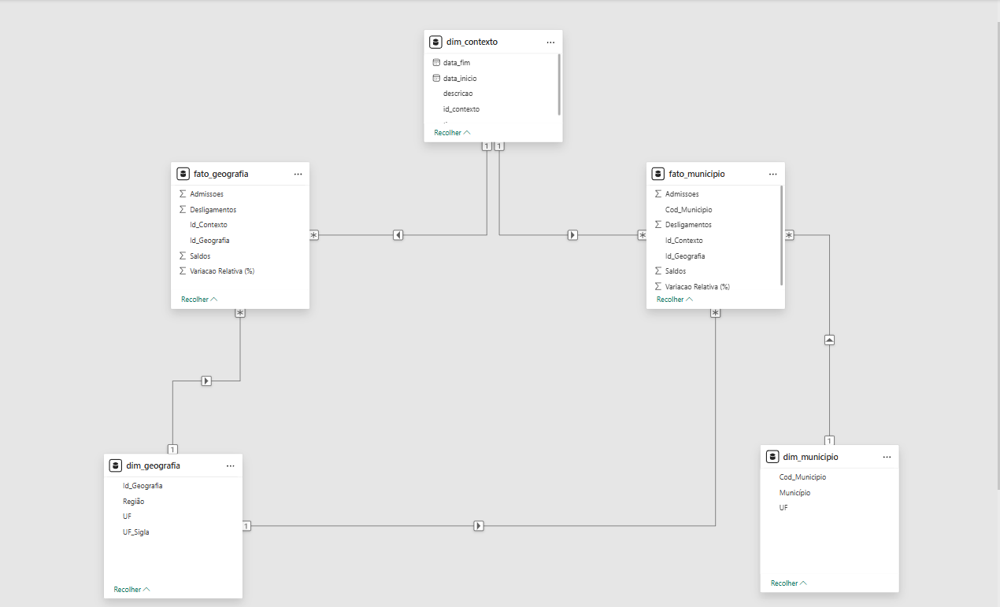
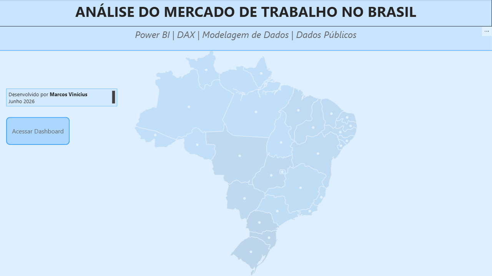
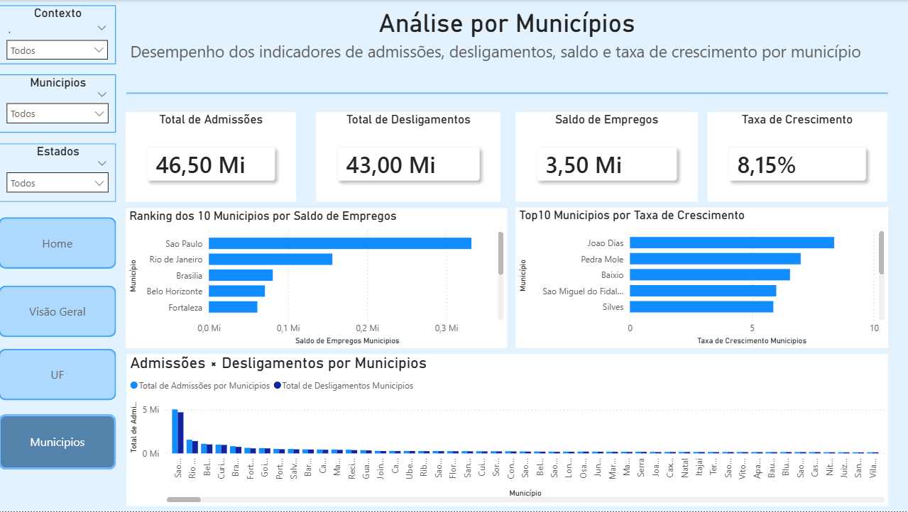

# 📊 CAGED BI – Análise do Mercado de Trabalho Brasileiro


---

## 📖 Sobre o projeto

Este projeto apresenta um dashboard analítico desenvolvido no Power BI utilizando dados do Cadastro Geral de Empregados e Desempregados (CAGED).

O objetivo é transformar dados públicos em informações que permitam analisar o comportamento do mercado de trabalho brasileiro sob diferentes perspectivas temporais e geográficas.

Durante o desenvolvimento foram aplicados conceitos de:

- Modelagem Dimensional
- Constelação de Fatos (Fact Constellation)
- Star Schema
- Power Query
- DAX
- Business Intelligence

---

## 🎯 Objetivos

O dashboard permite responder perguntas como:

- Como evoluiu o saldo de empregos ao longo do tempo?
- Quais municípios apresentaram maior geração de empregos?
- Quais estados tiveram melhor desempenho?
- Como admissões e desligamentos se comportam em cada período?
- Quais regiões concentram os maiores saldos?

---

## 🏛 Arquitetura do Projeto

```
CAGED
   │
   ▼
Power Query
   │
   ▼
Modelo Dimensional
(Constelação de Fatos)
   │
   ▼
Medidas DAX
   │
   ▼
Dashboard Power BI
```

---

## 🗂 Estrutura do Repositório

```
caged-bi-project/

data/
├── CAGED_2023.xlsb
├── tabela 1.csv
├── tabela 2.csv
├── tabela 3.csv
├── tabela 4.csv
├── tabela 5.1.csv
├── tabela 5.csv
├── tabela 6.1.csv
├── tabela 6.csv
├── tabela 7.1.csv
├── tabela 7.csv
├── tabela 8.1.csv
├── tabela 8.csv
└── tabela 9.csv

docs/
├── data_dictionary.md
└── model_description.md

images/
├── 00_Home.png
├── 01_Visão-Geral.png
├── 02_UF.png
├── 03_Municipios.png
├── 04_modelo-constelacao.png

powerbi/
└── Mercado_de_Trabalho_CAGED.pbix

sql/
├── 01_create_tables.sql
├── 02_relationships.sql
└── README_sql.md

README.md
```

---

# 🧩 Modelo Dimensional

O projeto utiliza uma **Constelação de Fatos**, composta por duas tabelas fato compartilhando uma dimensão temporal.

📌 **Modelo completo**



---

# 📈 Dashboard

### Página inicial



### Indicadores por Município



Caso o arquivo esteja publicado no Power BI Service:

➡️ **Acesse o dashboard online:**

> **(coloque aqui o link do Power BI Service)**

---

## 📊 Principais Indicadores

- Total de admissões
- Total de desligamentos
- Saldo de empregos
- Ranking de municípios
- Ranking de estados
- Evolução temporal
- Indicadores regionais

---

## 🗃 Modelo de Dados

| Tabela | Tipo |
|---------|------|
| dim_contexto | Dimensão |
| dim_municipio | Dimensão |
| dim_geografia | Dimensão |
| fato_municipio | Fato |
| fato_geografia | Fato |

A documentação completa pode ser consultada em:

📄 **docs/data_dictionary.md**

📄 **docs/model_description.md**

---

## 🛠 Tecnologias

- Power BI Desktop
- Power Query
- DAX
- SQL Server (DDL)
- Git
- GitHub

---

## 📚 Base de Dados

Os dados utilizados são provenientes do Cadastro Geral de Empregados e Desempregados (CAGED), disponibilizado pelo Governo Federal.

---

## 👤 Autor

Marcos Vinícius

Projeto desenvolvido para compor meu portfólio de Business Intelligence e Análise de Dados.

- GitHub: https://github.com/marcosvinicius-data
- LinkedIn: https://linkedin.com/in/marcosvinicius-data
